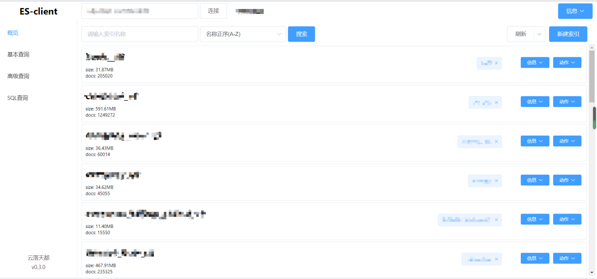
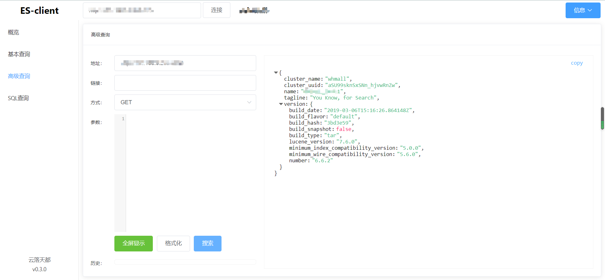

# es-client

仿照elasticsearch head编写的es查询客户端，使用vue+element-ui编写

## 项目使用

目前可以打包成

- 静态文件
- exe应用
- chrome插件

## 项目打包

### 静态文件

```bash
npm install
npm run build
```

文件在`/electron/html`

### exe应用

```bash
npm install
npm run build
cd electron
npm install
npm run package:win32
```

文件在`/electron/out/es-client-win32-x64`

## chrome插件

```bash
npm install
npm run build
```

之后在`/chrome`文件夹下建立`es-client`文件夹，将`/electron/html`文件夹中内容复制到`/chrome/es-client`文件夹中

安装：打开浏览器，打开拓展，将chrome拖入浏览器

## 预览





## 目前进度

1. 概览完成主要功能
2. 基础搜索勉强能用
3. 高级搜索基本完成
4. SQL搜索未开始

## 未来计划

1. 完成首页操作按钮
2. 优化历史记录，使用indexedDB记录历史记录
3. 完成基础查询（注意es可以存储对象的问题）
4. 基础查询，高级查询增加table视图
5. 增加使用SQL查询es的方法
